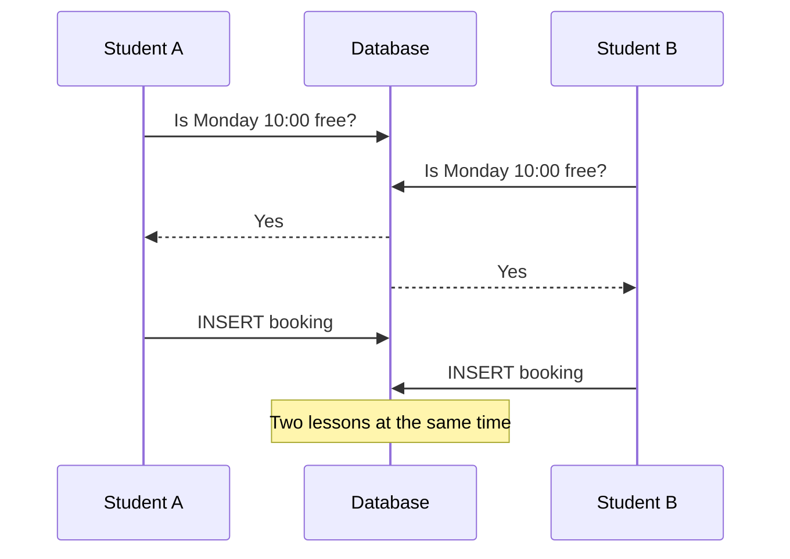

# Ngajarin

**Online lesson booking for private tutors and tutoring centers.** Each workspace gets a public
booking page; students pick a subject, a teacher and a free time, and no teacher (or student) can
ever be booked twice for the same time, even when two people click the same slot at the same
moment.

**Live demo: [ngajarin.denyfebriawan.dev](https://ngajarin.denyfebriawan.dev)**. Click
**Try as a tutor** or **Try as a student** on the home page; no sign-up needed. The demo workspace
is rebuilt every night, so feel free to book, cancel and change things.

| Demo account            | Email                        | Password   |
| ----------------------- | ---------------------------- | ---------- |
| Tutor (workspace owner) | `tutor@demo.ngajarin.test`   | `password` |
| Student                 | `student@demo.ngajarin.test` | `password` |

Built with Laravel 13, React 19 (Inertia), TypeScript and PostgreSQL 18.

## Features

- **Workspaces (multi-tenancy):** a tutor or tutoring center signs up and creates a workspace.
  One account can own a workspace, teach in another and study in a third, with a different role
  in each (owner, tutor, student).
- **Subjects:** lesson length and price per subject, and which teachers teach it.
- **Weekly hours and time off** per teacher, in the workspace's own time zone (WIB, WITA or WIT).
- **Public booking page** (`/t/{workspace}/book`): subject → teacher → a free time. The first
  booking makes the visitor a student of that workspace.
- **Lessons:** upcoming and past lessons for everyone involved; students, teachers and owners can
  cancel, which frees the time again.
- **Dashboards:** the workspace overview shows today's schedule and lesson/revenue numbers for
  today, this week and this month; the home page lists a user's upcoming lessons across all their
  workspaces.

## How double-booking is prevented

This is the core design decision of the project.

### The problem

The obvious approach checks in PHP whether the slot is still free, then inserts the booking. Two
requests that arrive at the same moment both run the check before either has inserted anything,
so **both see the slot as free and both insert**:



More careful PHP doesn't fix this; only the database sees every insert, in order.

### The solution: an exclusion constraint in PostgreSQL

Each booking stores its time as a `tstzrange` (a range of timestamps), computed by Postgres from
`starts_at` and `ends_at` so it can never disagree with them. An **exclusion constraint** then
forbids two confirmed bookings for the same teacher whose ranges overlap:

```sql
ALTER TABLE bookings ADD COLUMN period tstzrange
    GENERATED ALWAYS AS (tstzrange(starts_at, ends_at, '[)')) STORED;

ALTER TABLE bookings ADD CONSTRAINT bookings_teacher_no_overlap
    EXCLUDE USING gist (teacher_id WITH =, period WITH &&)
    WHERE (status = 'confirmed');
```

- `teacher_id WITH =, period WITH &&` reads as: _no two rows may have the same teacher **and**
  overlapping periods_. Postgres checks this on every insert and update, atomically, so of two
  simultaneous requests exactly one succeeds.
- `'[)'` makes ranges half-open: a 10:00–11:00 lesson and an 11:00–12:00 lesson don't overlap,
  so back-to-back lessons are allowed.
- `WHERE (status = 'confirmed')` makes it a partial constraint: cancelling a lesson frees its time.
- The same constraint exists for `student_id`, so a student can't be in two lessons at once either.
- The constraints deliberately don't include the workspace: someone who teaches in two workspaces
  still can't be booked in both at the same time.
- Mixing `=` on an integer with `&&` on a range in one GiST index needs the `btree_gist`
  extension, which a migration enables.

### What the application does with it

1. **Before:** the booking form only offers free times (`App\Scheduling\SlotFinder` subtracts
   existing lessons and time off from the teacher's weekly hours), and the request is validated
   against the same list.
2. **Booking:** joining the workspace and inserting the lesson happen in one transaction, so a
   failed booking leaves no half-finished membership behind.
3. **Losing the race:** if another booking committed first, Postgres rejects the insert with
   SQLSTATE `23P01` (exclusion violation). The controller catches exactly that error and turns it
   into a friendly message: _"Sorry, someone booked that time a moment ago. Please pick another."_

The checks in PHP give a good experience; the constraint guarantees correctness. The tests
simulate the race by inserting a competing booking at the last moment, between validation and
insert.

## Architecture

### Multi-tenancy

- **Path-based workspaces:** `/t/{slug}/...`. The `EnsureTenantMember` middleware resolves the
  workspace, returns 404/403 for unknown workspaces or non-members, and makes it the _current
  tenant_ for the request. It runs before route model binding, so later lookups are already
  scoped.
- **A global scope that fails closed:** every workspace-owned model uses the `BelongsToTenant`
  trait. Its query scope limits reads to the current tenant and returns **no rows** when there is
  no current tenant (console commands, jobs, non-workspace pages), so forgetting to set the tenant
  can't leak another workspace's data. Code that must read across workspaces opts out explicitly.
- **Composite foreign keys:** a booking references `(tenant_id, subject_id)` and
  `(tenant_id, teacher_id)` / `(tenant_id, student_id)` on the membership table, so the database
  itself refuses a lesson whose subject or people belong to another workspace.
- **Roles and permissions:** Laravel Policies decide who may do what (owners manage subjects and
  settings, teachers edit their own hours, cancelling depends on who you are in the lesson). The
  frontend receives `can` flags only to decide which buttons to show; every action is checked
  again on the server.

### Time zones

Times are stored as `timestamptz` (UTC); each workspace has an IANA time zone, and weekly hours
are local times in that zone. Laravel formats dates without their UTC offset when sending them to
the database, which stored `10:00 WIB` as `10:00 UTC` (seven hours off). A small custom Postgres
connection and query grammar (`app/Database`) keeps the offset, for model saves and query
bindings alike. "Today" on the dashboards is always the workspace's today, which the tests check
around midnight.

### Frontend

Inertia renders React pages from Laravel controllers without a separate API. Typed route and
controller helpers generated by [Wayfinder](https://github.com/laravel/wayfinder) replace
hard-coded URLs, so renaming a route breaks the TypeScript build instead of a link in production.

## Other rules the database enforces

| Rule                                                                          | How                                                                           |
| ----------------------------------------------------------------------------- | ----------------------------------------------------------------------------- |
| A teacher's weekly hours never overlap                                        | `EXCLUDE USING gist` on a range built from local times                        |
| Time off never overlaps                                                       | `EXCLUDE USING gist` on a `tstzrange`                                         |
| Lessons end after they start, prices aren't negative, nobody books themselves | `CHECK` constraints                                                           |
| Lesson lengths are 15–480 minutes                                             | `CHECK` constraint                                                            |
| Workspace addresses are unique                                                | Unique index, with a race between two sign-ups turned into a validation error |
| Roles are owner, tutor or student                                             | `CHECK` constraint                                                            |

## Testing

About 280 tests with [Pest](https://pestphp.com), run against a **real PostgreSQL database**
(not SQLite), so the exclusion constraints, ranges and time zones are tested exactly as they run
in production. They cover, among other things:

- double-booking of teachers and students, back-to-back lessons, cancelled lessons freeing their
  slot, and a teacher shared by two workspaces;
- losing a booking race (a competing booking is inserted between validation and insert);
- tenant isolation: data from one workspace never visible in another, and the scope failing
  closed;
- permissions per role;
- time zones and "today" around local midnight, with the clock frozen;
- N+1 queries, by counting the queries a page runs;
- the demo data, built on every day of the week to prove it never breaks a constraint.

Static analysis runs with PHPStan (Larastan) at level 7, alongside Pint for PHP formatting, the
TypeScript compiler, and frontend linting and formatting through Vite+.

## CI/CD and hosting

- **GitHub Actions** runs every check (lint, types, static analysis, all tests against a
  `postgres:18` service container) on each pull request and push.
- **Continuous deployment:** after the checks pass on `main`, a second job connects over SSH with
  a deploy key that the server restricts to running one script (`deploy/deploy.sh`), so a leaked
  key can't open a shell.
- **Server:** an Ubuntu 24.04 VM on Azure running Nginx, PHP-FPM, PostgreSQL 18, a systemd queue
  worker and the Laravel scheduler, with HTTPS from Let's Encrypt. Setup is scripted in
  [`deploy/`](deploy): `provision.sh` (packages, firewall, fail2ban, swap), `setup-app.sh`
  (database, app, PHP-FPM pool, Nginx, services, certificate) and `deploy.sh` (every release).

## Running it locally

Requirements: PHP 8.4, Composer, Node.js 22+, and PostgreSQL 18 (the `btree_gist` extension ships
with Postgres and is enabled by a migration).

```bash
git clone https://github.com/denyfebriawan/ngajarin.git
cd ngajarin
cp .env.example .env          # then set DB_USERNAME and DB_PASSWORD for your Postgres
createdb ngajarin             # the app's database
createdb ngajarin_test        # the tests' database
composer setup                # installs dependencies, generates the key, migrates, builds assets
php artisan db:seed           # builds the demo workspace
composer run dev              # http://localhost:8000
```

Log in with the demo accounts above, or set `DEMO_ENABLED=true` in `.env` to get the one-click
buttons. Emails (such as verification links) are written to `storage/logs/laravel.log`.

Run all checks with `composer test` (formatting, static analysis and the test suite) and
`npm run check` / `npm run types:check` for the frontend.

## Project layout

| Path                            | What's there                                                                 |
| ------------------------------- | ---------------------------------------------------------------------------- |
| `app/Tenancy`                   | Current tenant, the fail-closed global scope and the `BelongsToTenant` trait |
| `app/Scheduling/SlotFinder.php` | Turns weekly hours, time off and lessons into free start times               |
| `app/Http/Controllers/Tenant`   | Workspace pages: subjects, hours, time off, lessons, booking                 |
| `app/Policies`                  | Who may do what, per role                                                    |
| `app/Database`                  | The offset-preserving Postgres connection and grammar                        |
| `app/Demo/DemoWorkspace.php`    | Builds the demo workspace; `php artisan demo:reset` runs it nightly          |
| `database/migrations`           | Schema, including every constraint above                                     |
| `resources/js/pages`            | React pages rendered through Inertia                                         |
| `deploy/`                       | Server setup and deploy scripts                                              |
| `tests/Feature`                 | The test suite, grouped by feature                                           |

## Roadmap

1. Email reminders 24 hours before a lesson (queues, scheduler, notifications).
2. Live calendar updates when someone books (Laravel Reverb).
3. Online payments or deposits (Midtrans or Xendit), with webhook handling.
4. An analytics dashboard for owners (revenue, busiest hours, retention) using Postgres window
   functions.
5. A plain-language slot finder ("Tuesday afternoons next week") backed by an LLM.
